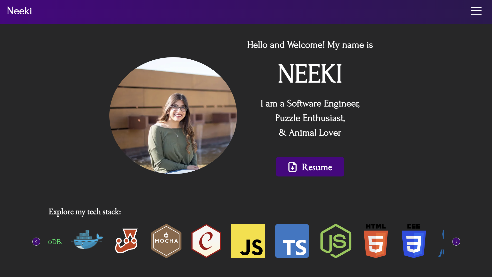

# Personal Portfolio Website

Welcome to my personal portfolio website! Designed with a mobile-first approach and responsive layout to ensure an optimal viewing experience on all devices. 

This portfolio is built using Next.js, TypeScript, and Sass, providing a modern and performance-optimized web experience.

## Features

The website iincludes the following features:

1. **Home**: A welcoming introduction to visitors.
2. **About**: A narrative of my journey to become a software engineer.
3. **Projects**: A showcase of the projects I've worked on throughout my career.
4. **Contact**: A section where users can reach out to me.

## Installation

First, clone the repository:

    git clone https://github.com/yourgithubusername/next-ts-sass-portfolio.git
    cd next-ts-sass-portfolio

Then, install the project dependencies:

    npm install

## Running the Application

You can start the development server with:

    npm run dev

Build the application with:

    npm run build

Start the application with:

    npm run start
## Contact

If you have any questions, feel free to contact me at `neeki.askari@gmail.com` or send me a message through my website. Enjoy browsing through the portfolio!

